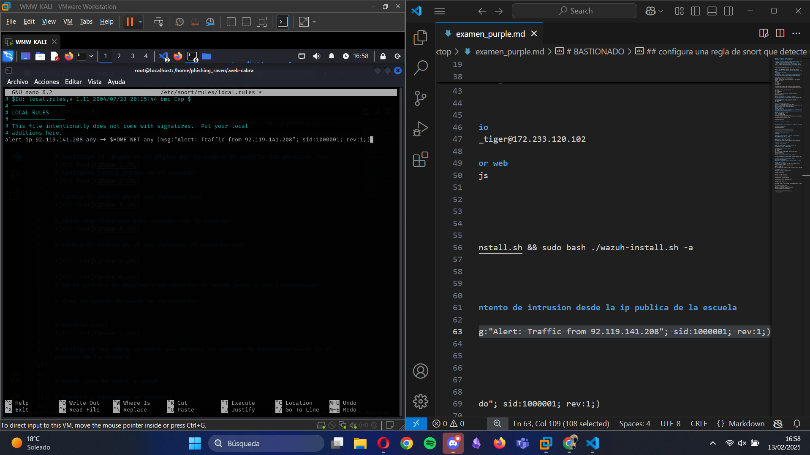

# Crea un repositorio para la documentación de la prueba

# Reconocimiento de servicios en el servidor

# Accede al servidor con tu usuario en menos de 10 minutos

# BASTIONADO 

# Sustituye la imagen de tu página por tu nombre de usuario sin permisos root

# Configura canary tokens en el servidor

# Cambia el puerto en el que funciona SSH

# Añade una clave RSA para acceder con tu usuario

# Cambia el puerto en el que funciona el servidor web

# Sé el primero en desplegar un servidor de wazuh junto a sus credenciales

# Crea un agente de wazuh en tu servidor

# Instala snort

# Configura una regla de snort que detecte un intento de intrusión desde la IP pública de la escuela

# Manda logs de snort a wazuh

# Instala y configura un honeypot

# Cambia el tipo de algoritmo usado para guardar las contraseñas en /etc/shadow por uno mas seguro

# INTRUSION

# Manda 50 pings a otro jugador

# Eres el primero en acceder al servidor de otro jugador

# Eres el segundo en acceder al servidor de otro jugador

# Romper la contraseña de otro jugador

# Acceder al servidor de otro jugador

# Modifica la web de otro usuario

# Crea un archivo oculto en /root

# Crea un hook a un servidor de beef en la web de otro usuario

# Haz una denegación de servicio del servicio web

# Cambia el puerto SSH de un jugador

# Añade tus claves RSA al VPS y accede usandolas

# Elimina las claves RSA de acceso del jugador

# Detecta un intento de intrusión desde el NAT de la escuela
lo tengo en el correo

# Roba logs del usuario

# Roba pcaps del usuario

# Elimina logs del usuario

# Elimina pcaps del usuario

# POST-INCIDENTE

# Detectar un intento de intrusión de otro jugador

# Detectar un ping de otro jugador

# Levantar una alerta cuando otro jugador modifique la web

# Levantar una alerta cuando otro jugador cree un archivo en /root

# Detectar intentos de intrusión en los analisis de tráfico con .pcap

# Detectar si otro usuario tiene fail2ban instalado

# Detectar si un jugador ha hecho mas de 50 pings a tu servidor

# Detectar si un jugador te ha robado logs

# Levantar una alerta con un canary token

# Mantén tu nombre en la página principal al final de la ronda de intrusión

# Captura 1000 paquetes y guardalos en un .pcap

# Captura 5000 paquetes y guardalos en un .pcap

# Captura 10000 paquetes y guardalos en un .pcap